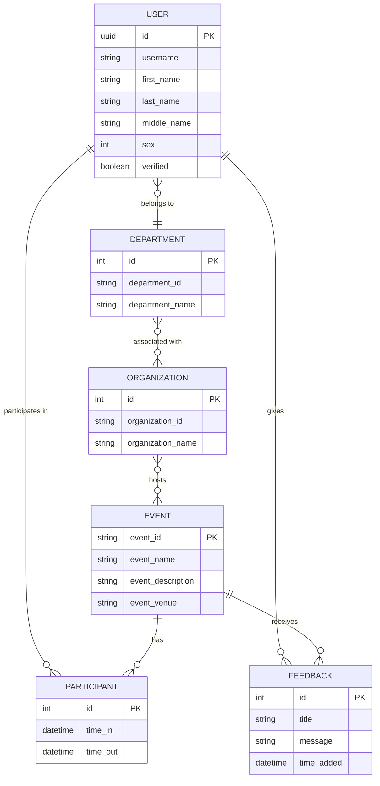
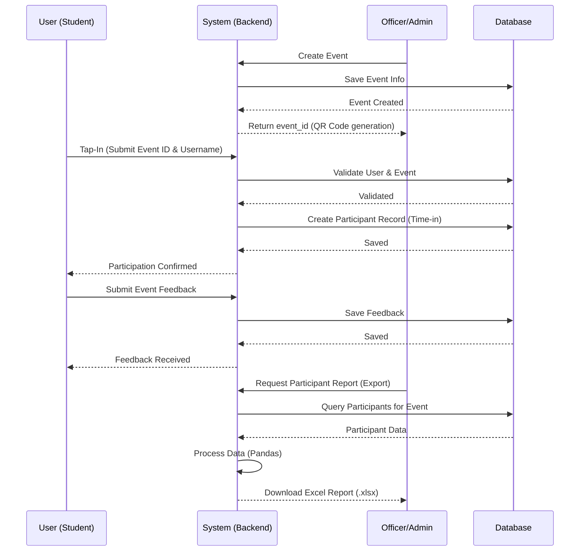

# QR TapIn
#### DLL BSIT Department x IT Paradigm x DLL E.L.I.T.E

---

### Introduction

> This project is a QR-based attendance and event management system designed for institutional use. It facilitates efficient tracking of participants and management of departments, organizations, and events.

---

### Tech Stack & Versions

- **Language:** Python 3.13.7
- **Framework:** Django 6.0.5
- **API:** Django REST Framework 3.17.1
- **Authentication:** JWT (SimpleJWT 5.5.1)
- **Database:** PostgreSQL (psycopg2-binary)
- **Data Processing:** Pandas, NumPy, Openpyxl
- **Deployment:** Vercel, WhiteNoise, Gunicorn/Uvicorn

---

### Project Structure

```text
.
├── Accounts/          # User management, profiles, and signals
├── BaseAuth/          # Base authentication mixins, paginators, and shared logic
├── Departments/       # Department management and viewsets
├── DLL_TapIn/         # Project configuration, settings, and URL routing
├── Events/            # Event management and participant tracking
├── Feedbacks/         # Feedback collection and analysis
├── Organizations/     # Organization management
├── core/              # Core application logic, updates, and templates
├── certs/             # Security certificates (e.g., Aiven CA)
├── backup_data/       # Exported data and backups (CSV/Excel)
├── manage.py          # Django management script
├── requirements.txt   # Project dependencies
└── vercel.json        # Vercel deployment configuration
```

---

### System Overview

#### Database Schema
The following diagram illustrates the relationships between core entities in the system:



#### Process Flow
The typical interaction flow for event attendance and management:



---

### Installation

<h3><font color="red">Please note that you need first to activate your <code>Virtual Environment</code> before you install these dependencies. You may install it using <code>pip install virtualenv</code> and activate it using <code>python -m venv venv</code>.</font></h3>

```bash
# Clone the repository
git clone <repository-url>

# Create and activate virtual environment
python -m venv venv
source venv/bin/activate  # On Windows: venv\Scripts\activate

# Install dependencies
pip install -r requirements.txt

# Run migrations
python manage.py migrate

# Collect static files
python manage.py collectstatic
```

---

### For testing with frontend

```bash
python manage.py runserver 0.0.0.0:8000
```

---

### Contribution Guidelines

We welcome contributions from students and developers. To maintain a professional and organized workflow, please follow these rules:

1. **Feature Branching:** Always create a new branch for any feature or bug fix. Do not commit directly to the `main` or `master` branch.
   ```bash
   git checkout -b feature/your-feature-name
   ```
2. **Branch Cleanup:** Once a feature is completed and successfully merged, the feature branch **must be deleted** immediately to keep the repository clean.
3. **Professional Commenting:** Since this project serves as a learning archive for students, use clear and professional comments. Explain the *why* behind complex logic to help future student developers understand the codebase.
4. **No Environment Secrets:** Never commit `.env` files or hardcode sensitive credentials.

---

### Contributors

1. [Abdul Barry Adam](https://github.com/warebar) - Backend Developer
2. [Kurt Cyrus Atoat](https://github.com/seiyanndev) - Head Designer
3. [Peter Paul Eclavea](https://github.com/lpeter29) - Tester
4. [Bernard Gabito](https://github.com/brrnrd) - Tester
5. [Rogemson Molina](https://github.com/Rogemson) - Designer
6. [Ryann Kim Sesgundo](https://github.com/RyannKim327) - Developer

### Credits

- **Documentation & Assistant:** [Gemini CLI](https://github.com/google-gemini/gemini-cli) - Provided architectural guidance, documentation updates, and development assistance.

---

### License

This project is licensed under a custom **Institutional and Educational License**. See [LICENSE.md](LICENSE.md) for full details. 
**Note:** Commercial use, selling the software, or selling gathered data for advertising is strictly prohibited.
